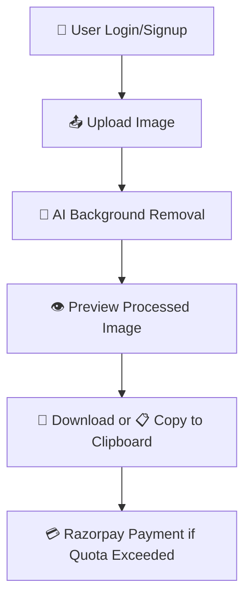

# 🧠 SmartAI - Background Removal Web App

⚡ *AI-powered SaaS solution that removes image backgrounds instantly, designed for creatives, developers, and businesses.*

A full-stack background remover application built with Spring Boot and MySQL for the backend, and Vite + React for a fast, interactive frontend.

## 📦 Project Overview

**SmartAI** is a full-stack, intelligent image background removal tool built for speed and usability. Using **React + Vite** on the frontend and **Spring Boot** on the backend, SmartAI offers smooth, secure, and responsive performance. 

With features like one-click background removal, copy-to-clipboard, secure **Clerk** authentication, and **Razorpay** for monetization, this project is engineered with **user psychology** in mind — simple UI, minimal clicks, real-time feedback.

## 🚀 Technologies Used

| 🧱 Layer       | 🛠️ Technologies                                                           |
|---------------|---------------------------------------------------------------------------|
| 🎨 Frontend    | [React](https://reactjs.org), [Vite](https://vitejs.dev), [Tailwind CSS](https://tailwindcss.com), [Clerk](https://clerk.dev), Clipboard API |
| 🧠 Backend     | [Spring Boot](https://spring.io/projects/spring-boot), REST API          |
| 💾 Database    | [MySQL](https://www.mysql.com)                                            |
| 💳 Payments    | [Razorpay](https://razorpay.com)                                          |
| 🧰 Other Tools | [JWT](https://jwt.io), [Axios](https://axios-http.com), SaaS Integration |

### 🎯 Feature Planning

- 📤 Upload image
- ✂️ Remove background using AI
- 👁️ Preview result
- 💾 Download / 📋 Copy image
- 👤 Clerk-authenticated user access
- 💳 Razorpay payment system (pay-per-use or credits)


  ## 🧾 Content Requirements

### 📝 Text
- Status messages (upload, loading, success)
- Auth prompts (login, signup)
- Payment instructions


### 🖼️ Images
- Uploaded images
- Processed transparent images

### 📹 Videos
- ❌ Not supported currently


## 🌐 SEO & Content Strategy

- 📱 Mobile-first design for accessibility
- 🏷️ Meta tags for better search engine indexing
- ⚛️ React Router for clean routing (if applicable)

## 🙋‍♂️ User Stories

> 🖼️ *As a user, I want to remove the background of my image easily so I can use it professionally.*

> 🛍️ *As a seller, I need clean product photos to build trust and drive sales.*

> ⚙️ *As a developer, I want a simple API-backed app to process images on the fly.*


## 🏗️ Structure Plane

### 🧩 Interaction Design

- SPA architecture
- Upload → AI Remove → Preview → Download
- Auth + Payment only when needed

---

## 🔄 User Flow Diagram



📸 Output Screens

1️⃣ Upload Interface

2️⃣ Processed Result

3️⃣ Download/Copy Screen

🙏 Acknowledgements

We gratefully acknowledge the frameworks and tools that made this project possible:

⚛️ React + Vite — blazing fast frontend development

🎨 Tailwind CSS — responsive utility-first styling

☕ Spring Boot — structured backend APIs

🛢️ MySQL — relational storage for user sessions and image metadata

🔐 Clerk — smooth and secure authentication

💳 Razorpay — integrated digital payments

📋 Clipboard API — for fast and simple user workflows

🌍 Open Source Community — for libraries, docs, and guides


Absolutely! Below is a comprehensive and professional **`README.md`** section with all essential **installation instructions**, **setup steps**, **environment config**, **run commands**, and other recommended details. This makes your GitHub project complete and developer-friendly.

---

## 🛠️ Installation & Setup Guide

Follow the steps below to get the **SmartAI - Background Removal Web App** running on your local machine.

---

### 📁 Clone the Repository

```bash
git clone https://github.com/your-username/smartai-remove-bg.git
cd smartai-remove-bg
```

---

## 🧑‍💻 Project Structure

```bash
smartai-remove-bg/
│
├── backend/               # Spring Boot project
│   ├── src/               # Java source files
│   └── pom.xml            # Maven config
│
├── frontend/              # React + Vite frontend
│   ├── src/               # Components & pages
│   └── vite.config.js     # Vite config
│
└── README.md              # Documentation
```

---

## ⚙️ Prerequisites

Make sure these tools are installed:

| Tool       | Version      | Required For        |
| ---------- | ------------ | ------------------- |
| Node.js    | >= 18.x      | Frontend            |
| npm / yarn | >= 9.x / 1.x | Frontend            |
| Java       | >= 17        | Spring Boot Backend |
| Maven      | >= 3.8.x     | Build Backend       |
| MySQL      | >= 8.x       | Database            |

---

## 🚀 Frontend Setup (React + Vite)

```bash
cd frontend
npm install        # or yarn
npm run dev        # starts local dev server on http://localhost:5173
```

**Frontend Features:**

* Image upload and preview
* Background removal call
* Clipboard copy and download
* Clerk Auth integration
* Razorpay Payment support

---

## ☕ Backend Setup (Spring Boot)

1. Update your MySQL config in `application.properties`:

```properties
spring.datasource.url=jdbc:mysql://localhost:3306/smartai
spring.datasource.username=your_username
spring.datasource.password=your_password
```

2. Run the backend:

```bash
cd backend
./mvnw spring-boot:run   # or mvn spring-boot:run
```

> Backend runs at `http://localhost:8080`

---

## 🔑 Clerk Configuration (Frontend)

Register at [Clerk.dev](https://clerk.dev) and add your keys in `.env`:

```env
VITE_CLERK_PUBLISHABLE_KEY=your_publishable_key
```

---

## 💳 Razorpay Configuration

Register at [Razorpay](https://razorpay.com) and update:

```env
VITE_RAZORPAY_KEY=your_razorpay_key
```

You may also secure Razorpay secret in the backend.

---

## 📦 Environment Variables

Create `.env` file in **frontend**:

```env
VITE_BACKEND_API=http://localhost:8080
VITE_CLERK_PUBLISHABLE_KEY=xxx
VITE_RAZORPAY_KEY=xxx
```

For **backend**, use:

```properties
# application.properties
jwt.secret=your_secret_key
razorpay.key_id=your_key
razorpay.key_secret=your_secret
```

---

## 🧪 Testing

**Frontend:**

```bash
npm run test
```

**Backend:**

```bash
./mvnw test
```

---

## 📂 Build for Production

**Frontend:**

```bash
npm run build
```

**Backend:**

```bash
./mvnw clean package
```

---

## 📌 Common Issues & Fixes

| Issue                                   | Solution                                       |
| --------------------------------------- | ---------------------------------------------- |
| `vite: command not found`               | Install globally with `npm i -g vite`          |
| `java.lang.ExceptionInInitializerError` | Check MySQL config or missing env variable     |
| Clerk auth not working                  | Ensure public key is correctly added in `.env` |
| CORS error                              | Enable CORS in Spring Boot config              |

---

## 📄 License

This project is licensed under the **MIT License**.

---

## 🤝 Contributing

Contributions are welcome! Please:

1. Fork the repo
2. Create a feature branch
3. Commit your changes
4. Submit a Pull Request

---

## 🙌 Support

Feel free to contact:

* 📧 **Email**: [chaudharilalit717@gmail.com](mailto:chaudharilalit717@gmail.com)
* 📞 **Phone**: +91 7058097985
* 🔗 **LinkedIn**: [linkedin.com/in/lalit-chaudhari](www.linkedin.com/in/lalit-chaudhari-a16a10246)

---

