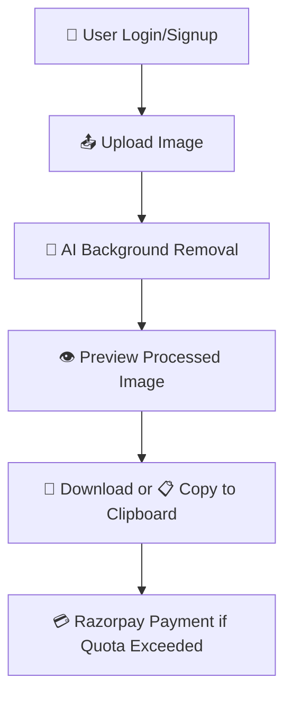

# 🧠 SmartAI - Background Removal Web App

⚡ *AI-powered SaaS solution that removes image backgrounds instantly, designed for creatives, developers, and businesses.*

A full-stack background remover application built with Spring Boot and MySQL for the backend, and Vite + React for a fast, interactive frontend.

## 📦 Project Overview

**SmartAI** is a full-stack, intelligent image background removal tool built for speed and usability. Using **React + Vite** on the frontend and **Spring Boot** on the backend, SmartAI offers smooth, secure, and responsive performance. 

With features like one-click background removal, copy-to-clipboard, secure **Clerk** authentication, and **Razorpay** for monetization, this project is engineered with **user psychology** in mind — simple UI, minimal clicks, real-time feedback.

## 🚀 Technologies Used

| 🧱 Layer       | 🛠️ Technologies                                                           |
|---------------|---------------------------------------------------------------------------|
| 🎨 Frontend    | [React](https://reactjs.org), [Vite](https://vitejs.dev), [Tailwind CSS](https://tailwindcss.com), [Clerk](https://clerk.dev), Clipboard API |
| 🧠 Backend     | [Spring Boot](https://spring.io/projects/spring-boot), REST API          |
| 💾 Database    | [MySQL](https://www.mysql.com)                                            |
| 💳 Payments    | [Razorpay](https://razorpay.com)                                          |
| 🧰 Other Tools | [JWT](https://jwt.io), [Axios](https://axios-http.com), SaaS Integration |

### 🎯 Feature Planning

- 📤 Upload image
- ✂️ Remove background using AI
- 👁️ Preview result
- 💾 Download / 📋 Copy image
- 👤 Clerk-authenticated user access
- 💳 Razorpay payment system (pay-per-use or credits)

  ## 🧾 Content Requirements

### 📝 Text
- Status messages (upload, loading, success)
- Auth prompts (login, signup)
- Payment instructions

### 🖼️ Images
- Uploaded images
- Processed transparent images

### 📹 Videos
- ❌ Not supported currently

## 🌐 SEO & Content Strategy

- 📱 Mobile-first design for accessibility
- 🏷️ Meta tags for better search engine indexing
- ⚛️ React Router for clean routing (if applicable)

## 🙋‍♂️ User Stories

> 🖼️ *As a user, I want to remove the background of my image easily so I can use it professionally.*

> 🛍️ *As a seller, I need clean product photos to build trust and drive sales.*

> ⚙️ *As a developer, I want a simple API-backed app to process images on the fly.*

## 🏗️ Structure Plane

### 🧩 Interaction Design

- SPA architecture
- Upload → AI Remove → Preview → Download
- Auth + Payment only when needed

---

## 🔄 User Flow Diagram

📸 Output Screens

1️⃣ Upload Interface

2️⃣ Processed Result

3️⃣ Download/Copy Screen

🙏 Acknowledgements

We gratefully acknowledge the frameworks and tools that made this project possible:

⚛️ React + Vite — blazing fast frontend development

🎨 Tailwind CSS — responsive utility-first styling

☕ Spring Boot — structured backend APIs

🛢️ MySQL — relational storage for user sessions and image metadata

🔐 Clerk — smooth and secure authentication

💳 Razorpay — integrated digital payments

📋 Clipboard API — for fast and simple user workflows

🌍 Open Source Community — for libraries, docs, and guides

